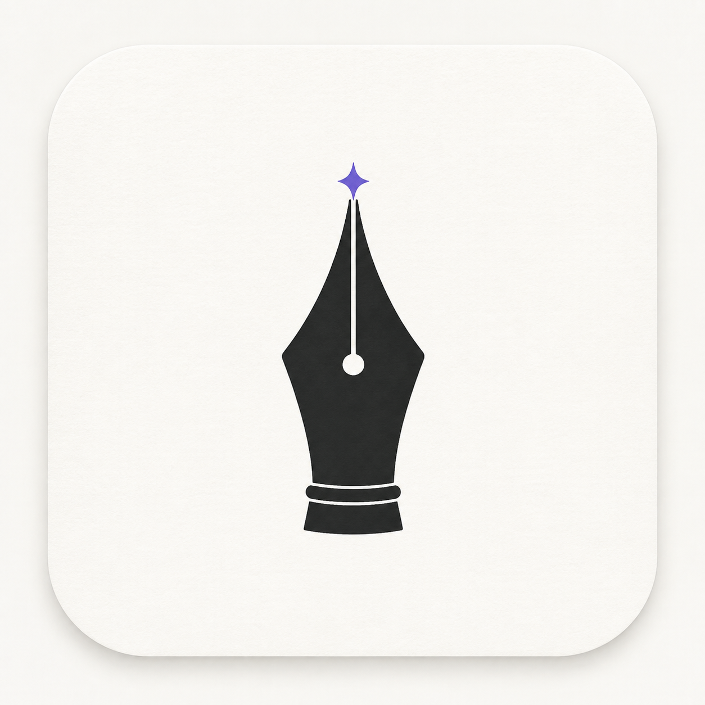

# 声念

<p align="center"></p>

> 声落成章，念起成行。

一款 Android 原生的 **AI 灵感笔记与智能待办**应用：把零散输入快速沉淀为可检索、可执行、可回顾的个人知识流。

从记录开始，声念自动完成意图分流、结构化整理、待办提取、提醒安排与语义关联，让每个想法都能被再次找到，并自然转化为下一步行动。

## 核心优势

- **从灵感到行动一条链**：笔记、待办、多次精确提醒、手机日历同步和来源回溯在同一条工作流里完成，减少在多个工具之间切换。
- **AI 整理结果可直接使用**：自动生成标题、摘要、分类、标签和重点内容，也能从长记录中提炼明确的行动项；链接正文和图片信息会作为受控参考资料参与整理。
- **灵感可以继续生长**：标记灵感、筛选灵感流、查看相关笔记，并可选择多条已有笔记交给 AI 合并为新的整理稿。
- **本地优先，节奏稳定**：输入先落库，AI 整理异步执行；网络波动时可以重试，提醒与洞察始终围绕本地数据运行。
- **链接与图片一起理解**：输入中的 HTTP(S) 页面会提取标题和正文；速记页与详情页支持最多 4 张图片，图片复制到本地后交给视觉模型识别，失败时原附件仍保留。
- **图表与合并**：详情页可生成受校验的流程图 / 思维导图；首页可多选已整理笔记，生成新的合并笔记而不删除原文。

## 特性

- **极速记录**：首页中央 FAB 直达速记页，进入即弹键盘；系统分享菜单一键收文本；桌面长按快捷方式「新建灵感 / 新建待办」
- **AI 意图分流**：一次调用区分「笔记 / 待办」。待办自动生成截止时间与本地提醒；笔记自动整理出标题、分类、类型、情绪、标签、摘要，并提炼其中可执行的待办
- **链接、图片与图表**：HTTP(S) 链接提取标题/正文后参与整理；Photo Picker 图片复制到应用私有目录并按视觉请求发送；详情页可生成流程图或思维导图，结果以受校验 JSON 和原生 Canvas 保存
- **灵感归类与合并**：AI 输出灵感标记，首页可筛选灵感；选择多条 READY 笔记后生成新的合并笔记，原笔记、附件和来源不删除
- **编辑后二次整理**：详情页可修改标题和正文、增删图片，并选择仅保存或保存后重新交给 AI 整理
- **待办可持续管理**：可编辑内容、截止时间、提醒次数、提醒间隔和每次具体触发时间；提醒方式可选响铃 / 振动 / 静音，并可在授权后同步到手机日历
- **三协议自由接入**：OpenAI Chat Completions / OpenAI Responses / Anthropic Messages，Base URL 任意填——官方 API、DeepSeek、各类中转、本地 Ollama 均可
- **语义关联网络**：独立的 Embedding 配置（任何 OpenAI 兼容端点），三路召回（向量余弦 / 标签 Jaccard / 实体重合）+ LLM 复核，自动建立笔记双向链接并给出关联理由
- **本地提醒与日历**：AlarmManager 精确闹钟（杀进程可达）、多次提醒、开机重排、通知内「完成 / 延期 10 分钟」，响铃 / 振动 / 静音三种提醒方式可选；用户授权日历权限后，待办会创建、更新并在删除时取消系统日历事件
- **洞察页**：记录条数、待办完成率、连续记录点阵、24h 记录时段分布、灵感关键词云——全部纯本地聚合
- **隐私优先**：API Key 存 Android Keystore（AES/GCM），数据全在本地 Room；Markdown + JSON 一键导出备份
- **检查更新**：设置页查询 GitHub 最新 Release，展示更新日志；有 APK 附件时可直接下载并交给系统安装器更新

## 界面设计

视觉基准：[`docs/design/shengnian-ui.html`](docs/design/shengnian-ui.html)（设计规范 + 5 屏画板，浏览器直接打开）。

三条设计原则：**先记下来，再整理成章**（让记录自然进入 AI 工作流）· **单一点缀色**（紫罗兰 `#6B5CE7`，其余交给墨与灰阶）· **留白即节奏**（衬线承担「写」，无衬线承担「用」）。

## 技术栈与架构

Kotlin 2.x · Jetpack Compose (Material3) · Room · WorkManager · Hilt · OkHttp + kotlinx.serialization · Android Keystore

```
UI (Compose) → ViewModel (StateFlow) → 领域层 (CaptureController / AiPipeline / LlmGateway / LinkDiscovery / ReminderScheduler)
                                    → 数据层 (Room × 10 表 / DataStore / Keystore)
```

- **AI 层适配器模式**：`LlmAdapter` 统一接口收敛三协议差异为 `LlmRequest / LlmResult`，JSON 输出三级兜底（schema 约束 → 助手预填 → 解析兜底）
- **离线可靠**：输入先落库（PENDING_AI），AI 流水线走 WorkManager（联网约束 + 指数退避），失败可重试、数据永不丢
- **视觉模型限制**：图片识别与图表生成依赖用户在设置页配置的支持相应能力的模型；端点不支持视觉时保留本地附件并显示失败状态
- **HTTP 边界**：为兼容局域网模型和用户记录中的 HTTP 链接，应用允许明文 HTTP；网页抓取会拒绝本机、私网、保留地址和带凭据 URL，并手动限制重定向次数。仅应连接自己信任的地址，公开服务优先使用 HTTPS
- 详细设计决策见 [`docs/plans/2026-08-30-ai-voice-note-app.md`](docs/plans/2026-08-30-ai-voice-note-app.md) 与后续增量计划 [`docs/plans/2026-08-31-voice-note-incremental.md`](docs/plans/2026-08-31-voice-note-incremental.md)

## 构建

要求：JDK 17+，Android SDK（compileSdk 35）。

```bash
./gradlew :app:assembleDebug        # 调试包
./gradlew :app:testDebugUnitTest    # JVM 单元测试（68 个：三协议契约 / 多模态 payload / DeepSeek Schema 与思考模式 / JSON 兜底 / URL、HTML 与主机安全策略 / 图表校验 / 合并输入 / 关联算法 / GitHub Release 解析与版本比较）
./gradlew :app:compileDebugAndroidTestKotlin # instrumentation 测试编译（含真实 v3→v4 Room migration）
./gradlew :app:connectedDebugAndroidTest    # 连接真实设备或模拟器后运行 instrumentation 测试

Debug APK 使用 `com.voiceink.app.test`，用于与手机上已有的正式包并存；Release 仍使用 `com.voiceink.app`。
./gradlew :app:assembleRelease      # 发布包（需在 local.properties 配置签名，见下）
```

发布签名（`local.properties`，不会入库）：

```properties
sdk.dir=<Android SDK 路径>
storeFile=<keystore 绝对路径>
storePassword=<...>
keyAlias=<...>
keyPassword=<...>
```

## 配置（首次使用）

设置页（首页右上角「念」进入）：

| 区块 | 说明 | 示例 |
|---|---|---|
| AI 模型 | 协议三选一 + Base URL + API Key + 模型名，「测试连接」验证 | `https://api.deepseek.com` + `deepseek-v4-flash` |
| 语义向量 | 独立开关与端点，任何 OpenAI 兼容 `/v1/embeddings` | `https://api.siliconflow.cn/v1` + `Qwen/Qwen3-Embedding-8B` |
| 模型思考 | 可开关，支持低 / 中 / 高强度；配置贯穿 OpenAI Chat、OpenAI Responses 和 Anthropic Messages | — |
| 通用 | 关联发现开关、打开直进速记、默认提前提醒、提醒方式（响铃 / 振动 / 静音）、日历授权与同步、重建知识网络、导出备份、检查更新 | — |

未配置 Embedding 时自动降级为「标签 + AI 分析」关联模式，功能不退化。

待办到点弹出通知提醒（抬头通知，可配响铃 / 振动 / 静音），全部为本地 AlarmManager 调度。日历同步只在用户授予系统日历读写权限后执行，授权失败不会阻止待办本地保存。

## 验证记录（2026-08-31）

- JVM 单元测试：`80 tests completed, 0 failed`
- 已通过 `:app:compileDebugAndroidTestKotlin`、`:app:assembleDebug`；Release 版本为 `0.5.0`（versionCode `7`）
- 真机 `RMX5062` 上使用独立测试包 `com.voiceink.app.test`：DeepSeek Chat 连接测试成功；SiliconFlow Embedding 连接测试成功，返回向量维度 `4096`
- 输入「明天早上 7:50 起床」后，待办成功落库并进入提醒调度；编辑保存后生成 3 个具体提醒时间，系统 `dumpsys alarm` 显示 3 个 `AlarmClock` 精确闹钟
- CalendarProvider 查询到对应事件及三次提醒描述；随后删除临时测试待办，设备上未保留测试日历事件和提醒
- 测试凭据仅通过手机设置页运行时输入，未写入源码、文档、构建产物或 Git 历史

## 许可证

[MIT](LICENSE)
